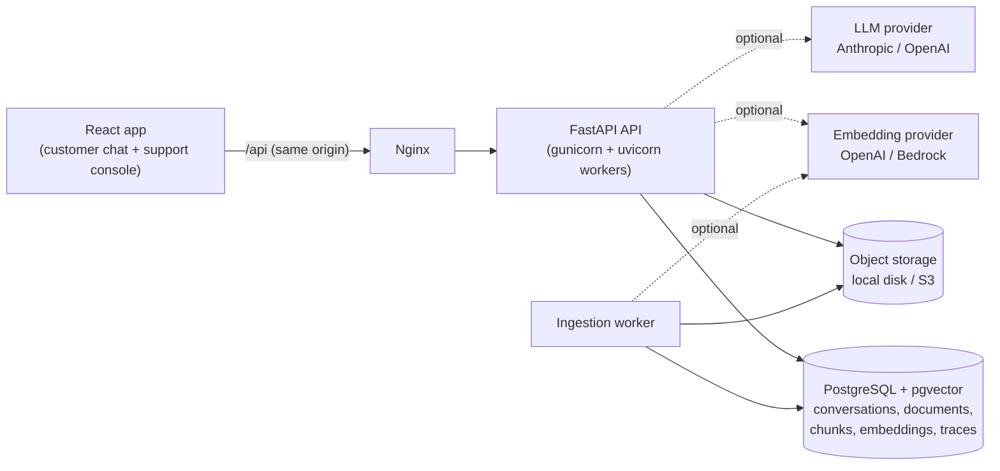

# Acme Support - grounded customer-support AI agent

A production-oriented MVP of a customer-support assistant that answers **only from an
approved knowledge base**, cites the exact evidence behind every answer, and **abstains or
hands off to a human** when the evidence is missing, weak, contradictory or cannot be
verified.

> If the system does not have sufficient evidence, it says so instead of guessing.

No system can guarantee zero hallucinations. This one is built for *strictly grounded
generation with controlled abstention*: the language model is a reasoning component over
retrieved evidence, never the source of truth, and every answer must pass deterministic
(and, with an LLM, model-judged) grounding validation before a customer sees it.

Detailed design: [`docs/architecture.md`](docs/architecture.md) ·
[`docs/rag.md`](docs/rag.md) · [`docs/security.md`](docs/security.md)

---

## Features

### Customer chat (`/chat`)

- ChatGPT-style interface: conversation sidebar with history and full-text search, suggested
  questions, timestamps, mobile layout.
- **Streamed answers (SSE) that are only sent after validation** - customers never see text that
  later fails a grounding check.
- **Citations** on every answer: document title, page/section and the supporting excerpt, expandable
  inline.
- Clear, honest outcomes: *answer*, *"I don't have that information"* (abstention with an offer of a
  person), clarifying question for ambiguous requests, or handoff.
- **Talk to a human** at any time (button or by asking); status banners for *waiting for support*,
  *resolved* and *closed*, with who did it and when.
- Helpful / not-helpful **feedback** with reasons and an optional comment.
- Human agent replies appear in the same chat (polling every 5 seconds).
- Multi-turn context: follow-ups such as *"what about international orders?"* are rewritten into
  standalone questions before retrieval.
- Close or delete own conversations; starting the same question again continues the existing chat
  instead of creating a duplicate.

### Grounded RAG agent

- **Query understanding:** deterministic rules always run (intent, follow-up rewriting, sensitive
  topics, explicit handoff requests, prompt-injection detection); an optional LLM pass can add but
  never remove safety flags.
- **Policy layer** decides before retrieval whether a request must go to a person: explicit requests,
  frustration, disputed answers, sensitive or account-specific requests, and repeated failed answers.
  Legal, financial and medical questions may only be answered from official sources. Every handoff
  records a reason (also `KNOWLEDGE_CONFLICT`, `VALIDATION_FAILED`, `RETRIEVAL_FAILURE`,
  `PROVIDER_FAILURE`, `AI_ESCALATION`).
- **Hybrid retrieval:** pgvector cosine similarity + PostgreSQL full-text search fused with
  Reciprocal Rank Fusion; tenant, active-version and embedding-model filters are enforced in SQL.
- **Reranking** (heuristic by default, LLM reranker optional) and **evidence sufficiency** checks:
  relevance thresholds, query-term coverage and required entities (e.g. a product name must appear in
  the evidence).
- **Contradiction handling:** conflicting sources are detected and resolved by source authority
  (official policy > support article > FAQ ...) and then effective date; unresolved conflicts abstain
  or hand off.
- **Generation:** schema-constrained LLM answers (Anthropic Claude or OpenAI) with cited evidence
  IDs, or an offline extractive generator that only uses verbatim evidence sentences.
- **Grounding validation:** every citation must exist in the retrieved evidence, and numbers, dates,
  prices, durations, emails, phone numbers, URLs and named entities in the answer must be supported by
  cited text; a canary check catches system-prompt leakage; an LLM judge verifies claims in provider
  mode. A failed answer gets exactly one stricter retry, then abstains.
- **Deterministic confidence** (retrieval strength, coverage, validation, conflicts) decides between
  answer, abstain and handoff - never the model's self-reported confidence.
- **Prompt-injection defenses:** retrieved text is data inside delimited evidence blocks,
  instruction-like chunks are flagged at ingestion and marked as data-only in the prompt, such text is
  never repeated as an answer, and user attempts to override instructions are detected and refused.
- Provider failures and timeouts never produce a guessed answer: the customer gets a
  "temporarily unavailable" message and a `PROVIDER_FAILURE` handoff.
- Versioned prompts (`backend/app/prompts/*.md`) and a full **RAG trace** stored for every assistant
  message (query analysis, retrieved chunks with scores, selected evidence, validation results, stage
  latencies, decision).

### Support console (`/admin`, agents and admins)

- **Dashboard:** conversations, waiting-for-a-person count, abstention rate, average and p95 response
  time, retrieval success, validation failures, helpful-feedback rate, searchable documents; breakdowns
  of handoff reasons, abstention reasons and not-helpful feedback; recent unanswered questions;
  document versions by status; selectable time window.
- **Handoff queue:** pending / assigned / resolved filters, assign to me (the API also accepts another
  agent's ID), handoff reason and priority; replying to a pending handoff assigns it automatically.
- **Conversations:** every conversation in the tenant with status, customer, search, and badges for
  *Reopened* (with count), resolved-by and closed-by details.
- **Conversation inspector:** full transcript, human replies, mark resolved, close, delete (admin),
  and a **trace inspector** per AI answer (retrieved chunks, scores, validation, confidence).
- **Knowledge base (admin only):** upload PDF/DOCX/HTML/Markdown/TXT with title, source authority,
  category, product, locale and effective date; processing status, versions, ingestion errors, edit
  metadata, reindex, deactivate and delete.
- **Retrieval debugger (admin only):** run any question through query analysis, retrieval, reranking
  and evidence sufficiency without generating an answer.

### Conversation lifecycle

- Statuses *Open -> Waiting for support -> Waiting for customer -> Resolved -> Closed*, each
  transition recording the actor and timestamp, adding a transcript line and an audit entry.
- Customer replies reopen resolved chats in place (*"Reopened by ..."* line and **Reopened** badge).
- Resolved chats with no reply are **closed automatically** after `RESOLVED_AUTO_CLOSE_DAYS`.
- Duplicate protection: the same opening question continues the recent open chat; empty chats are
  never listed. Details in [Conversation lifecycle](#conversation-lifecycle).

### Knowledge ingestion

- Upload validation (extension, MIME type, magic bytes, size) and a safety scan that rejects PDFs with
  JavaScript/launch actions/embedded files and macro-enabled or zip-bomb DOCX files.
- Background worker using PostgreSQL as the queue (`FOR UPDATE SKIP LOCKED`, safe to scale).
- Structure-aware chunking (headings, paragraphs, lists, tables, page numbers) and metadata extraction.
- **Versioning** with atomic activation (the previous version keeps answering until the new one is
  READY), SHA-256 de-duplication, reindex, and per-model vector storage so embedding models can be
  switched without mixing vectors.
- Local disk or S3 object storage.

### Security and multi-tenancy

- JWT sessions in an HttpOnly cookie with a CSRF header requirement (or Bearer tokens for API
  clients); argon2 password hashing.
- Role-based access control: **CUSTOMER**, **AGENT**, **ADMIN**; only admins manage documents, use the
  retrieval debugger, delete conversations and read the audit log.
- Every tenant-owned row carries `company_id`; customers are further scoped to their own
  conversations; cross-tenant access returns 404. Retrieval filters by tenant in SQL.
- Rate limits per bucket (login, chat, upload, admin), security headers, strict CORS, upload size and
  input length limits, production config validation (strong `JWT_SECRET`, secure cookies).
- **Audit log** for logins, uploads, document changes, handoffs and conversation transitions.
- Conversation retention job (`CONVERSATION_RETENTION_DAYS`). Threat model in
  [`docs/security.md`](docs/security.md).

### Observability and operations

- Structured logs (JSON in production) with request ID, user, tenant, stage latencies, retrieval
  counts and decisions; secrets and message content are not logged.
- `/health` (liveness) and `/ready` (database and storage checks) endpoints; OpenAPI docs.
- CLI for seeding, ingestion, reindexing, vector index creation, retention, auto-close, user creation
  and evaluation.
- Docker images (non-root), Docker Compose stack (db, migrate, backend, worker, frontend) and GitHub
  Actions CI (lint, types, unit, integration + RAG eval, frontend, image builds).

### Quality

- **RAG evaluation framework** with a golden dataset (answerable, unanswerable, ambiguous, multi-turn,
  conflicting sources, prompt injection, handoff, irrelevant retrieval) and enforced thresholds for
  retrieval, groundedness, citation correctness, abstention accuracy, hallucination rate and handoff
  accuracy.
- Backend unit tests (no DB, no network; scripted fake LLM covering hallucinated numbers, fabricated
  citations, judge rejection, outages), integration and end-to-end API tests against real
  PostgreSQL + pgvector, and frontend component/unit tests.

---

## Architecture at a glance



Every chat turn runs: query understanding -> safety/handoff policy -> hybrid retrieval
(pgvector + full-text, RRF) -> reranking -> evidence sufficiency -> contradiction handling
-> grounded generation -> citation and claim validation (one stricter retry) ->
deterministic confidence -> **answer, abstain, or hand off**.

| Layer | Choice |
| --- | --- |
| Backend | Python 3.14, FastAPI, Pydantic v2, SQLAlchemy 2 (async), asyncpg, Alembic, structlog, gunicorn/uvicorn |
| Data | PostgreSQL 17 + pgvector 0.8 (HNSW), PostgreSQL full-text search |
| AI providers | `LLM_PROVIDER`: `none` (offline), `anthropic` (Claude via official SDK), `openai`; `EMBEDDING_PROVIDER`: `hashing` (offline), `openai`, `bedrock` |
| Frontend | React 19, TypeScript, Vite 7, Tailwind CSS 4, React Router 7 |
| Tooling | uv, Ruff, mypy, pytest, Vitest, ESLint, Docker, GitHub Actions |

### Offline mode vs. provider mode

The app runs fully without any API key (`LLM_PROVIDER=none`, `EMBEDDING_PROVIDER=hashing`):

- **Embeddings:** a deterministic feature-hashing embedder (lexical, not semantic).
- **Query understanding:** deterministic rules (follow-up rewriting, intent, sensitivity,
  handoff triggers, injection detection).
- **Answers:** an *extractive* generator that composes answers from verbatim evidence
  sentences - it cannot invent facts, but answers read less fluently than an LLM's.

Set `LLM_PROVIDER=anthropic` (default model `claude-opus-5`) or `openai` for fluent,
schema-constrained generation plus an LLM grounding judge; set a hosted embedding provider
for paraphrase-robust retrieval. The pipeline, validation and abstention rules are
identical in both modes.

---

## Repository layout

```
backend/
  app/
    api/            routes, dependencies (auth, RBAC, CSRF, rate limits), error handlers
    agents/         support agent orchestrator, safety/handoff policy, response copy
    rag/            retrieval, reranking, sufficiency, conflicts, generation, grounding, confidence
    llm/            provider abstraction (Anthropic, OpenAI), structured output, prompt registry
    prompts/        versioned system prompts (Markdown with front matter)
    ingestion/      validation, loaders (PDF/DOCX/HTML/MD/TXT), chunker, pipeline
    services/       chat, knowledge base, admin, metrics, auth, audit, retention
    models/ schemas/ repositories/ security/ storage/ observability/ workers/ evals/
    cli.py          seed, ingest, reindex, vector index, retention, users, eval
  alembic/          migrations
  seed/             fictional demo knowledge base (Acme) and a second tenant (Globex)
  tests/            unit/, integration/ (PostgreSQL), evals/ (golden dataset)
frontend/           React app, nginx config, Dockerfile
samples/            documents for the manual acceptance scenarios
docs/               architecture, RAG design, threat model
docker-compose.yml  db, migrate, backend, worker, frontend
```

---

## Prerequisites

- **Docker** with Compose v2 (for the one-command setup and for PostgreSQL + pgvector)
- For local development outside containers: **uv** (manages Python 3.14) and **Node.js 22+**

## Quick start (Docker Compose)

```bash
git clone https://github.com/raj-wankhede-github/AI-Agent-Customer-Support-RAG.git
cd AI-Agent-Customer-Support-RAG
cp .env.example .env
# Set JWT_SECRET (required):
python -c "import secrets; print(secrets.token_urlsafe(48))"   # paste into .env
# Optional: set LLM_PROVIDER / ANTHROPIC_API_KEY or OPENAI_API_KEY (see "Configuration")

docker compose up --build -d          # db -> migrate (one-shot) -> backend, worker -> frontend
docker compose exec backend python -m app.cli seed   # demo tenants, users and knowledge base
```

Open **http://localhost:8080** and sign in with a demo account.
API docs (Swagger UI): **http://localhost:8000/docs** (ReDoc at `/redoc`).

### Demo accounts (local development only)

| Role | Email | Password |
| --- | --- | --- |
| Admin | `admin@acme.example` | `AcmeAdmin!2026` |
| Support agent | `agent@acme.example` | `AcmeAgent!2026` |
| Customer | `customer@acme.example` | `AcmeCustomer!2026` |
| Customer (second tenant) | `customer@globex.example` | `AcmeCustomer!2026` |

These credentials exist only for local development. The seed command **refuses to create
them when `APP_ENV=production`** unless `SEED_*_PASSWORD` variables are provided, and the
login page lists them only in development builds. Never use them in a real deployment.

Roles: **CUSTOMER** sees only their own conversations. **AGENT** works the handoff queue,
views all conversations in the tenant and replies. **ADMIN** can additionally manage the
knowledge base, use the retrieval debugger, read the audit log and delete conversations.
Only admins can upload documents.

---

## Local development (without containers for the app)

```bash
cp .env.example .env                      # set JWT_SECRET
docker compose up -d db                   # PostgreSQL + pgvector on localhost:5432

# Backend
cd backend
uv sync --extra s3                        # creates .venv with Python 3.14 and dev tools
uv run alembic upgrade head               # migrations (explicit, never at app startup)
uv run python -m app.cli seed             # demo data
uv run uvicorn app.main:create_app --factory --reload --port 8000

# Frontend (second terminal)
cd frontend
npm install
npm run dev                               # http://localhost:5173 (proxies /api to :8000)
```

With `INGESTION_WORKER_EMBEDDED=true` (default in `.env.example`) the API process runs the
ingestion worker itself. Compose and production run it as a separate `worker` service
(`python -m app.workers.ingestion_worker`).

Ask the agent from the terminal, with full decision details:

```bash
uv run python scripts/ask.py -v "What is your standard shipping time?"
uv run python scripts/ask.py "What is your refund policy?" "What about international purchases?"
```

---

## Configuration

All configuration is environment variables, validated at startup by a typed settings
class (`backend/app/core/config.py`). `.env.example` documents every variable. Highlights:

| Variable | Purpose |
| --- | --- |
| `APP_ENV` | `development`, `test`, `production`. Production enforces a >=32-char `JWT_SECRET`, secure cookies and no wildcard CORS. |
| `DATABASE_URL` | `postgresql+asyncpg://...` |
| `JWT_SECRET` | **Required.** Signs session tokens. Store in a secret manager in production. |
| `LLM_PROVIDER`, `LLM_MODEL` | `none` / `anthropic` / `openai`. Anthropic defaults to `claude-opus-5`; OpenAI requires `LLM_MODEL`. |
| `ANTHROPIC_API_KEY`, `OPENAI_API_KEY` | Provider credentials (only the one you use). |
| `LLM_TEMPERATURE`, `LLM_MAX_TOKENS`, `LLM_MAX_INPUT_TOKENS`, `LLM_TIMEOUT_SECONDS`, `LLM_MAX_RETRIES` | Generation bounds and retry policy. Current Claude models reject sampling parameters, so temperature applies to OpenAI only. |
| `EMBEDDING_PROVIDER`, `EMBEDDING_MODEL`, `VECTOR_DIMENSION` | `hashing` / `openai` / `bedrock`. Changing any of these requires `python -m app.cli reindex-all`. |
| `RAG_TOP_K`, `RAG_MIN_SCORE`, `RAG_MIN_RERANK_SCORE`, `RAG_MAX_CONTEXT`, `RAG_MIN_QUERY_COVERAGE`, `RERANKER_ENABLED`, `RERANKER_PROVIDER` | Retrieval and evidence thresholds (reasoning in `docs/rag.md`). |
| `SOURCE_AUTHORITY_RANKING` | Authority order used to resolve conflicting sources. |
| `GROUNDING_MIN_CLAIM_SUPPORT`, `CONFIDENCE_HIGH_THRESHOLD`, `CONFIDENCE_MEDIUM_THRESHOLD` | Validation and confidence thresholds. |
| `MAX_UPLOAD_SIZE`, `STORAGE_PROVIDER`, `S3_BUCKET` | Upload limit and document storage (`local` or `s3`). |
| `CORS_ALLOWED_ORIGINS`, `AUTH_COOKIE_SECURE` | Browser security. |
| `RATE_LIMIT_*` | Per-bucket limits, e.g. `30/minute`. |
| `CONVERSATION_RETENTION_DAYS` | `0` keeps conversations; otherwise purge with `python -m app.cli purge-conversations`. |
| `RESOLVED_AUTO_CLOSE_DAYS`, `MAINTENANCE_INTERVAL_SECONDS` | Close resolved chats with no customer reply after N days (`0` disables); how often the worker checks. |
| `CONVERSATION_REUSE_WINDOW_HOURS` | How recently a chat must have been active to be continued when the same opening question is asked again. |

**Switching the embedding model** (e.g. to `text-embedding-3-small`, 1536 dimensions):
set the three embedding variables, run `python -m app.cli ensure-vector-index` if the
dimension is not 384/1024/1536, then `python -m app.cli reindex-all`. Vectors are stored
per model, and retrieval only compares vectors of the configured model, so old and new
embeddings are never mixed; each document keeps serving from its current version until its
re-embedded version is ready.

---

## Database and migrations

- Schema is managed by Alembic (`backend/alembic/versions`). The initial migration creates
  the `vector` extension, all tables and indexes, and partial HNSW indexes for 384/1024/1536
  dimensions.
- **Migrations never run inside the API or worker.** Compose runs a one-shot `migrate`
  service before starting the app; in production run `alembic upgrade head` as a separate
  task in your release pipeline, after a backup.
- Downgrades are destructive and exist only for explicit operator use.
- Verify models and migrations agree: `uv run alembic check`.

## Conversation lifecycle

| Status | Meaning |
| --- | --- |
| Open | The assistant answers. |
| Waiting for support | A handoff is pending or assigned; the assistant stays silent. |
| Waiting for customer | A human agent replied. |
| Resolved | Staff clicked **Mark resolved**. The chat stays open for replies. |
| Closed | Final. Readable in history, no new messages. |

- **Mark resolved** (agents, admins) resolves any open handoff, records who resolved it and when, and
  adds a timestamped *"Marked resolved by …"* line to the chat. The customer sees a banner saying
  support marked it resolved and that replying will reopen it.
- **Reopen:** when the customer writes again (or asks for a person) in a resolved chat, the **same**
  conversation reopens: a *"Reopened by …"* line is added, the assistant answers again, and the
  support console shows a **Reopened** badge (with a count if it reopened more than once).
- **Automatic close:** a resolved chat with no customer reply for `RESOLVED_AUTO_CLOSE_DAYS`
  (default 7) is closed by the worker, which checks every `MAINTENANCE_INTERVAL_SECONDS` (it can also
  be run from a scheduler with `python -m app.cli close-resolved`). The chat shows *"Conversation
  closed automatically after 7 days without a reply."*; `0` disables it.
- **Close** (customer or staff) records who closed it and when, with a transcript line.
- **No duplicate chats:** starting a chat whose opening question matches one of the customer's
  conversations that is not closed and was active within `CONVERSATION_REUSE_WINDOW_HOURS`
  (default 24) continues that conversation instead of creating another, reopening it if it was
  resolved. Conversations without any message are not listed. Different questions still start
  separate chats, as does anything after a chat is closed.

All transitions are written to the audit log (`conversation.resolved`, `conversation.reopened`,
`conversation.closed`, `conversation.auto_closed`).

## Knowledge base ingestion

Upload from **Support console -> Knowledge base -> Upload document** (admins only), or via
`POST /api/knowledge/documents`. Supported: PDF (text layer), DOCX, HTML, Markdown, TXT, up
to `MAX_UPLOAD_SIZE`.

`UPLOADED -> PROCESSING -> READY | FAILED` (documents can be `INACTIVE` or `DELETED`).

1. Validation: extension, declared type, content signature, size, and a safety scan that
   rejects PDFs with JavaScript/launch actions/embedded files and macro-enabled or
   zip-bomb DOCX files.
2. The file goes to object storage; a version row is queued.
3. The worker extracts text, normalizes it, extracts metadata (title, pages, effective date),
   chunks it by structure (headings, paragraphs, lists, tables; pages preserved), flags
   instruction-like text, embeds each chunk, and writes chunks, vectors and the READY status
   in **one transaction**, then activates the version.
4. Retrieval only ever reads each document's active version, so partially processed or
   failed content is never searchable. Failures record an error code and message, shown in
   the document detail page.

**Versioning:** uploading with `document_id` creates a new version; the previous version keeps
answering until the new one is READY, then becomes `SUPERSEDED`. **De-duplication:** identical
bytes (SHA-256) already in the tenant are reported as a duplicate and not re-embedded. To
change metadata only (title, authority, effective date), edit the document - no new version
is needed. **Reindex** re-processes the stored file as a new version.

---

## Testing

```bash
cd backend
uv run pytest -m "not integration"        # unit tests: no database, no network, no paid APIs
docker compose up -d db                   # integration tests need PostgreSQL + pgvector
uv run pytest -m integration              # API, ingestion, pgvector retrieval, E2E workflows, RAG eval
uv run pytest tests/unit/test_support_agent.py::test_unanswerable_question_abstains_without_citations  # one test
uv run ruff check . && uv run ruff format --check . && uv run mypy app

cd ../frontend
npm test && npm run lint && npm run typecheck && npm run build
```

Integration tests use `TEST_DATABASE_URL` (default: the `support_test` database created by
the compose init script), run migrations automatically, truncate tables between tests and
refuse to run against a database whose name does not end in `_test`. LLM behaviour is tested
with a scripted fake provider - including hallucinated numbers, fabricated citations,
judge rejections, refusals and outages.

## RAG evaluation

```bash
cd backend
uv run python -m app.cli eval             # uses the configured providers; writes reports/eval-latest.json
```

The golden dataset (`backend/tests/evals/golden_dataset.json`) covers answerable,
unanswerable, ambiguous, multi-turn, conflicting-source, prompt-injection, handoff and
irrelevant-retrieval cases. The runner ingests its corpus into a temporary tenant through
the real pipeline, runs each case through the real agent, reports retrieval (Recall@K,
Precision@K, MRR), generation (groundedness, citation correctness, answer correctness,
abstention accuracy) and safety (unsupported-answer rate, hallucination rate, off-target
answer rate, prompt-injection resistance, handoff accuracy), enforces thresholds (non-zero
exit on violation), and deletes the temporary tenant. The same evaluation runs in CI as an
integration test. Re-run it with `LLM_PROVIDER` set to compare providers.

To run the acceptance scenarios against a running deployment (development or staging only -
it creates data), use `uv run python scripts/live_acceptance.py --base-url http://localhost:8080`.

## Acceptance walkthrough

On a fresh database run `python -m app.cli seed --skip-documents`, then:

1. Sign in as `admin@acme.example`, open **Knowledge base**, upload
   `backend/seed/acme/shipping-policy.pdf` (authority *Official policy*), wait for **Ready**.
2. Sign in as `customer@acme.example` (another browser profile works well) and ask
   *"What is your standard shipping time?"* -> answer with a **Shipping Policy - Page 1** source.
3. Ask *"What is your CEO's favorite food?"* -> the assistant says it doesn't have the
   information and offers a person.
4. Ask *"Connect me to a human."* -> handoff; the conversation shows *waiting for support*.
5. As `agent@acme.example`, open **Handoff queue** -> open the conversation: full history,
   handoff reason and AI diagnostics. Reply -> the customer sees it within seconds.
6. Mark resolved and close -> the conversation stays in the customer's history.

More scenarios (multi-turn, contradictions, prompt injection) are in
[`samples/README.md`](samples/README.md). To see a provider failure handled safely, set
`LLM_PROVIDER=openai` with an invalid `OPENAI_API_KEY` and any `LLM_MODEL`: questions get a
"temporarily unavailable" message and a `PROVIDER_FAILURE` handoff, never a guessed answer.

---

## Production deployment

The images are cloud-neutral; a recommended AWS layout:

| Component | AWS service |
| --- | --- |
| Frontend (nginx + static assets) | ECS Fargate service behind an ALB (or S3 + CloudFront with `/api` routed to the ALB) |
| API (`backend` image, gunicorn) | ECS Fargate service, >= 2 tasks, ALB health check on `/ready` |
| Ingestion worker (`python -m app.workers.ingestion_worker`) | ECS Fargate service, 1+ tasks (safe to scale: claims use `SKIP LOCKED`) |
| Migrations (`alembic upgrade head`) | One-off ECS task in the deploy pipeline, before rolling the API |
| Database | RDS for PostgreSQL 16/17 with the `vector` extension, Multi-AZ, encrypted, automated backups |
| Documents | S3 (`STORAGE_PROVIDER=s3`, SSE enabled, bucket private), accessed via the task IAM role |
| Secrets | Secrets Manager / SSM Parameter Store injected as environment variables (`JWT_SECRET`, DB password, provider keys) |
| Logs and metrics | JSON logs to CloudWatch Logs; alarms on 5xx rate, `/ready` failures, handoff backlog |
| Retention job | Scheduled ECS task running `python -m app.cli purge-conversations` |

Production settings: `APP_ENV=production`, `AUTH_COOKIE_SECURE=true`, `LOG_JSON=true`,
`TRUST_PROXY_HEADERS=true` behind the ALB, `CORS_ALLOWED_ORIGINS` set to your domain,
`EXPOSE_API_DOCS=false` if the API should not be browsable, `INGESTION_WORKER_EMBEDDED=false`
(the image default). Terminate TLS at the load balancer. The in-memory rate limiter is
per process; put a shared limiter (e.g. Redis, or the ALB/WAF) in front for multi-task
deployments. Containers run as non-root users and contain no secrets.

## Operations

```bash
python -m app.cli ingest-pending          # process queued versions now
python -m app.cli reindex-all [--force]   # re-embed (after an embedding model change)
python -m app.cli ensure-vector-index     # HNSW index for VECTOR_DIMENSION
python -m app.cli purge-conversations [--days N] [--dry-run]
NEW_USER_PASSWORD='...' python -m app.cli create-user --company-slug acme --email a@b.com --name "A B" --role ADMIN
```

Logs are structured (JSON in production) with `request_id`, `user_id`, `company_id`,
stage latencies, retrieval counts, validation and decision fields; secrets and message
content are not logged. Every assistant message stores concise audit metadata and a full
RAG trace (visible to staff), and security-relevant actions are written to `audit_logs`.

## Troubleshooting

| Symptom | Fix |
| --- | --- |
| `JWT_SECRET is required` at startup | Set it in `.env` (see Quick start). |
| Backend container unhealthy | `docker compose logs migrate backend`; `/ready` reports which dependency failed. |
| Documents stuck in *Uploaded* | The worker is not running: `docker compose logs worker`, or set `INGESTION_WORKER_EMBEDDED=true` locally, or run `python -m app.cli ingest-pending`. |
| Document *Failed* with `NO_TEXT` | Scanned PDF without a text layer - OCR it before uploading. |
| Every answer abstains after changing embeddings | Run `python -m app.cli reindex-all`; retrieval ignores vectors from other models. |
| Upload says *already in the knowledge base* | Identical file content exists; edit that document's metadata or upload changed content. |
| Integration tests skipped | Start PostgreSQL (`docker compose up -d db`) or set `TEST_DATABASE_URL`. |
| Port already in use | Change `POSTGRES_HOST_PORT`, `BACKEND_HOST_PORT` or `FRONTEND_HOST_PORT` in `.env`. |
| `429 Too many requests` during manual testing | Raise `RATE_LIMIT_CHAT` / `RATE_LIMIT_LOGIN` locally. |

## Known limitations

- Offline mode is lexical: the hashing embedder and rule-based query understanding do not
  handle paraphrases or synonyms the way a hosted embedding model and LLM do, so offline
  mode abstains more often. Use provider mode for real traffic.
- Grounding checks are strongest for concrete facts (numbers, dates, names, contact
  details). Subtle semantic distortions (for example a dropped condition) rely on the LLM
  judge, which is available only in provider mode.
- English-oriented text processing (stemming, stopwords, sentence splitting).
- Scanned PDFs need OCR; the malware check is heuristic (plug an antivirus engine into
  `MalwareScanner`).
- Rate limiting is per process; no MFA or account lockout; no email notifications for
  agents; human replies reach customers by polling (every 5 seconds).
- The audit log is available through the API (`GET /api/admin/audit-logs`) but has no console page yet.
- Duplicate conversations created before duplicate protection existed are not merged.

---

## API overview

Interactive documentation: `http://localhost:8000/docs`. All routes except health and login require
authentication; browser clients send the `X-Requested-With` header on state-changing requests.

| Area | Endpoints |
| --- | --- |
| Auth | `POST /api/auth/login`, `POST /api/auth/logout`, `GET /api/auth/me` |
| Conversations (own) | `POST /api/conversations` (201 new, 200 continued), `GET /api/conversations`, `GET /api/conversations/{id}`, `POST /api/conversations/{id}/messages`, `POST /api/conversations/{id}/messages/stream` (SSE), `POST .../handoff`, `POST .../feedback`, `POST .../close`, `DELETE /api/conversations/{id}` |
| Support (agent, admin) | `GET /api/admin/conversations`, `GET /api/admin/conversations/{id}`, `POST .../messages`, `POST .../resolve`, `POST .../close`, `DELETE .../{id}` (admin), `GET /api/admin/handoffs`, `POST /api/admin/handoffs/{id}/assign`, `POST /api/admin/handoffs/{id}/resolve`, `GET /api/admin/agents`, `GET /api/admin/metrics` |
| Admin only | `POST /api/admin/retrieval/debug`, `GET /api/admin/audit-logs` |
| Knowledge base (admin) | `POST /api/knowledge/documents`, `GET /api/knowledge/documents`, `GET/PATCH/DELETE /api/knowledge/documents/{id}`, `POST /api/knowledge/documents/{id}/reindex` |
| Health | `GET /health`, `GET /ready` |

---

## Roadmap: planned features and improvements

### Answer quality and RAG

- **Semantic query expansion in offline mode** (synonyms / paraphrase dictionary) - for example
  *"how soon do I get my money back"* currently misses the refund-timing article (the one failing
  golden case).
- **Cross-encoder reranker** (e.g. a hosted rerank model) alongside the heuristic and LLM rerankers.
- **OCR for scanned PDFs** and image-heavy documents; table-aware answers.
- **Multilingual support:** language detection, per-locale stemming/stopwords and locale-filtered
  retrieval.
- **Answer caching** for frequent validated questions, invalidated when the cited document version
  changes.
- **Eval expansion:** larger golden dataset built from real unanswered questions, per-provider
  comparison reports in CI, regression alerts on metric drops.
- **Knowledge gap workflow:** turn recent unanswered questions into draft articles for admins to
  review.

### Support console

- **Real-time updates** via WebSockets or SSE for agent replies and the handoff queue instead of
  polling.
- **Notifications:** email / Slack alerts for new handoffs and SLA breaches; unread counters.
- **SLA tracking and queue routing:** skills- or product-based assignment, round-robin, priorities,
  first-response and resolution time metrics.
- **Audit log page**, CSV export of conversations and metrics, saved filters.
- **Canned responses** and AI-drafted replies that agents approve (with the same grounding checks).
- **Merge conversations** tool for historical duplicates and customer satisfaction (CSAT) survey on
  close.
- Document preview with highlighted cited passages; bulk upload and connectors (Confluence, Zendesk,
  Notion, Google Drive, S3 sync).

### Security and platform

- **SSO (OIDC/SAML)**, MFA, account lockout and password reset flows.
- **Shared rate limiter** (Redis) and a job queue option for very high ingestion volume.
- **OpenTelemetry tracing and Prometheus metrics** (stage timings are already span-shaped).
- PII detection and redaction in stored transcripts and logs; configurable per-tenant retention.
- Antivirus integration (ClamAV) for uploads; signed URLs for document downloads.
- Infrastructure as code (Terraform/CDK) for the AWS deployment, blue/green releases, and
  Playwright browser E2E tests in CI.
- Tenant self-service: company settings, user invitations and branding.
