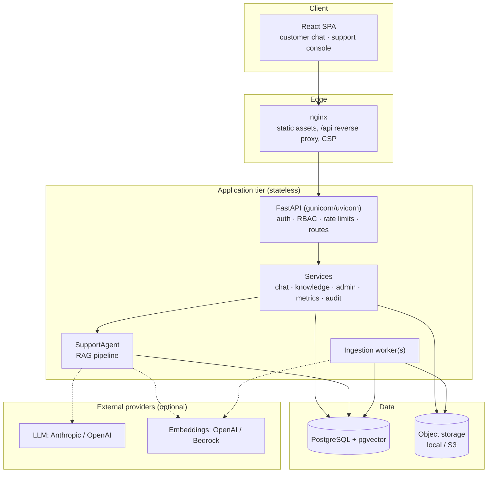
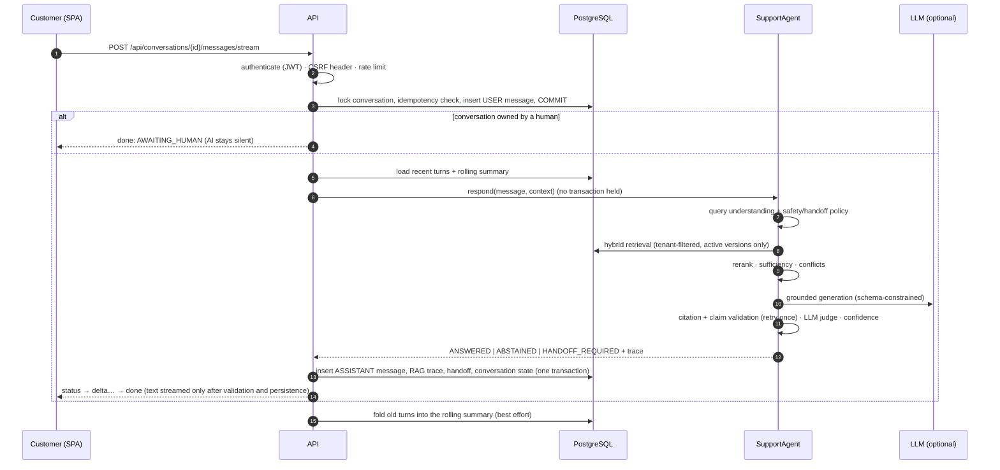
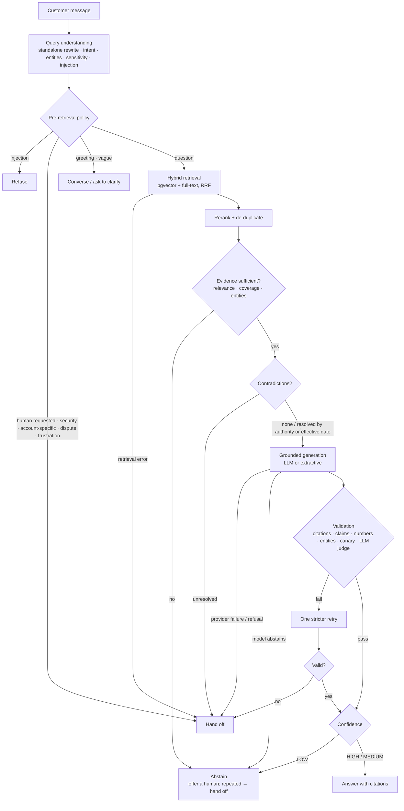
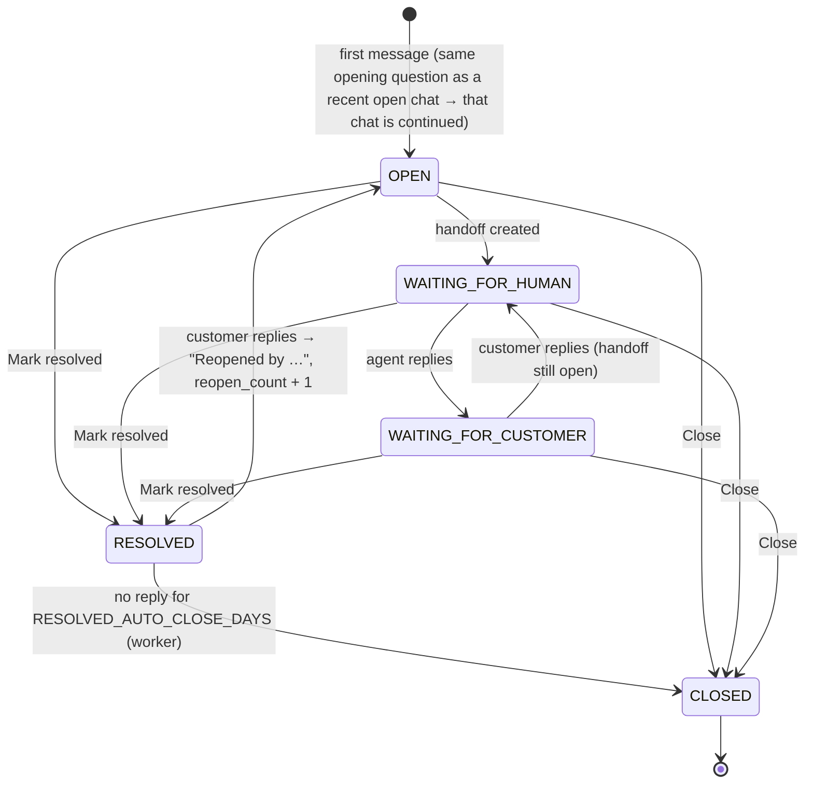
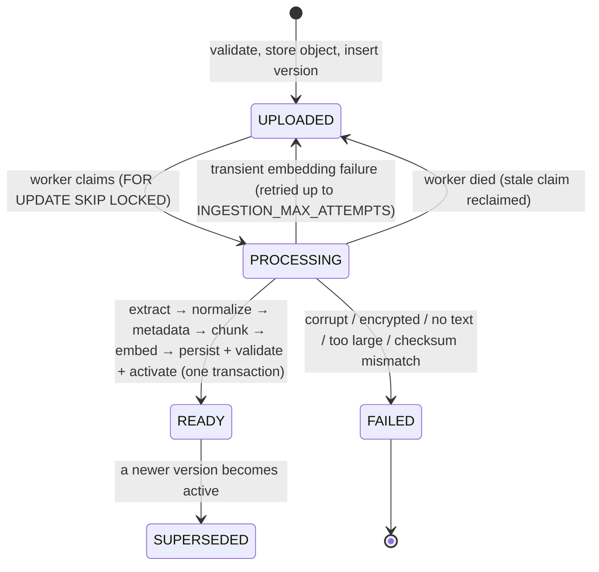
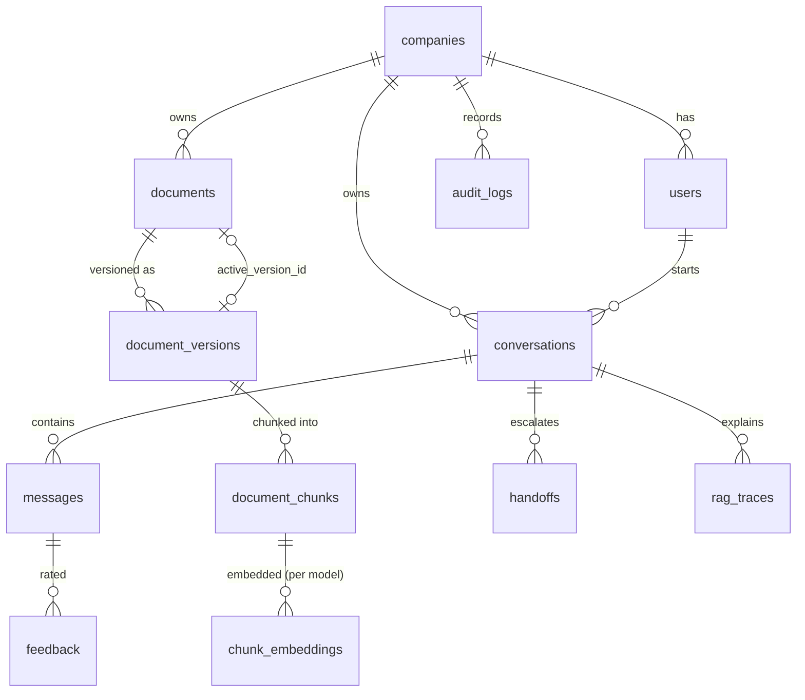
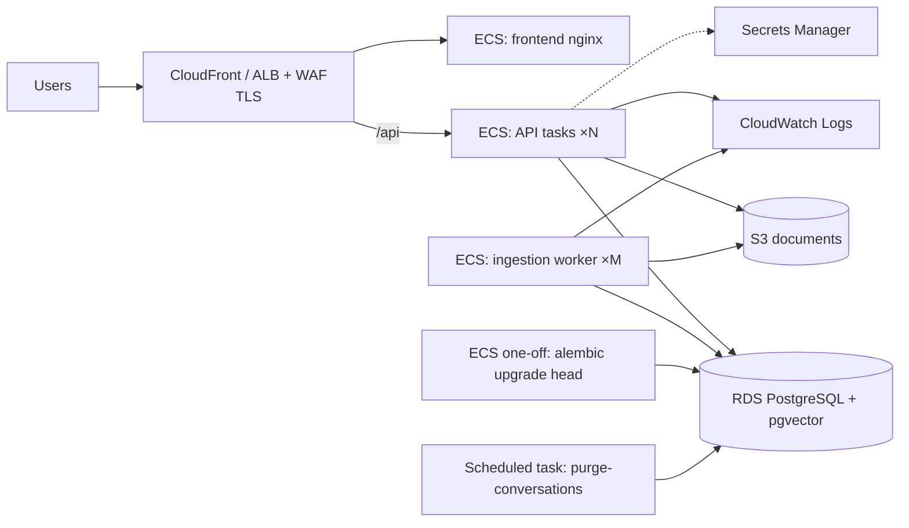

# Architecture

## System overview

**Composition root.** `app/core/container.py` builds the object graph (engine, storage,
embedder, LLM provider, retriever, reranker, generator, validator, agent, ingestion
pipeline) from settings. The API, worker, CLI and evaluation runner all use it, so they run
identical code paths. Tests pass overrides (a fake LLM, an in-memory retriever) instead of
monkeypatching.

**Provider abstraction.** Business logic depends on three protocols:
`LLMProvider.complete_json()` (`app/llm/base.py`), `EmbeddingProvider`
(`app/rag/embeddings/base.py`) and `ObjectStorage` (`app/storage/base.py`). Swapping a
provider is configuration, not code.

## Backend layout

| Package | Responsibility |
| --- | --- |
| `api/` | HTTP routes, dependencies (session, principal, RBAC, CSRF, rate limits), centralized error handling |
| `services/` | Use cases and transactions: chat turn, conversations, knowledge base, handoffs, metrics, audit, retention |
| `repositories/` | Tenant-scoped queries |
| `agents/` | Orchestration of one turn; deterministic safety/handoff policy; customer-facing copy |
| `rag/` | Retrieval, reranking, sufficiency, conflicts, generation, grounding, confidence, prompt assembly, memory |
| `llm/` | Providers, strict structured output, versioned prompt registry |
| `ingestion/` | Upload validation, loaders, normalization, chunking, pipeline |
| `models/`, `schemas/` | SQLAlchemy models and Pydantic API contracts |
| `security/` | Passwords, JWT, principal, rate limiting, prompt-injection detection |
| `observability/` | Structured logging, request context middleware, stage timings |
| `workers/`, `evals/`, `cli.py` | Background ingestion, evaluation harness, operations |

## Request lifecycle: one chat turn

The turn is split into three phases so no database transaction stays open while waiting on
an LLM, and nothing is reported as saved unless it was committed. If the client
disconnects mid-stream, the turn still completes and is stored. A `client_message_id`
makes retries idempotent. A global `CHAT_TIMEOUT_SECONDS` bounds the agent; on timeout or
any unexpected error the customer gets a safe message and a `PROVIDER_FAILURE` handoff.

## RAG lifecycle

Details, thresholds and reasoning: [`rag.md`](rag.md).

## Conversation lifecycle

Transitions live in `app/services/lifecycle.py`. Each one that changes what the customer can do
records the actor and time on the conversation (`resolved_by_user_id`, `closed_by_user_id`,
`closed_automatically`, `reopened_at`, `reopen_count`), writes a SYSTEM message into the
transcript and an audit entry. The automatic close claims rows with `FOR UPDATE SKIP LOCKED` via a
partial index on `resolved_at WHERE status = 'RESOLVED'`, so several worker replicas can run it.

## Ingestion lifecycle

The database is the queue: versions in `UPLOADED` are claimed with `SKIP LOCKED`, so any
number of workers can run, and work survives restarts. Moving to SQS or RabbitMQ later
means replacing `IngestionPipeline.claim_next()`; `process_version()` is unchanged.

## Data model

- Every tenant-owned row carries `company_id`, including chunks and embeddings, so tenant
  isolation is enforced directly in retrieval SQL rather than by joins alone.
- `chunk_embeddings` is keyed by `(chunk_id, embedding_model)` with a dimensionless
  `vector` column and partial HNSW indexes per dimension on `embedding::vector(N)`. A new
  embedding model can be built alongside the old one; vectors from different models are
  never compared. Moving to a dedicated vector database later means reimplementing
  `PgHybridRetriever` against the same `Retriever` protocol.
- `document_chunks.search_vector` is a generated, weighted `tsvector` (section path weight A,
  content weight B) with a GIN index.
- `rag_traces` stores the structured reason for every assistant turn (normalized query,
  candidates and scores, selected evidence, sufficiency, conflicts, validation, confidence,
  timings, prompt and model versions, tokens). No prompts or chain-of-thought are stored.
- Indexes cover conversation lookup by owner and status, message history, handoff queue,
  document status, the ingestion queue, checksums (dedupe), full-text and vector search.

## Security

See [`security.md`](security.md). In short: JWT sessions (HttpOnly SameSite cookie for
browsers plus a required custom header for cookie-authenticated writes, bearer tokens for
API clients) with server-side revocation; roles checked against the database on every
request; tenant and ownership filters in every query; strict upload validation;
retrieved content treated as untrusted data; rate limits; security headers; audit logging;
secrets only from the environment.

## Deployment

Health: `/health` is liveness (no dependencies); `/ready` checks the database (including the
`vector` extension) and storage. The API shuts down gracefully (stops the embedded worker,
disposes the pool); gunicorn's `graceful_timeout` lets in-flight requests finish.

## Scaling

| Concern | Approach |
| --- | --- |
| API throughput | Stateless; scale tasks horizontally. LLM latency dominates: size `WEB_CONCURRENCY` and connection pools accordingly. |
| Ingestion | Scale worker tasks; `SKIP LOCKED` prevents double processing. Embedding batches are bounded. |
| Vector search | HNSW partial indexes; `hnsw.ef_search` raised per query. Past tens of millions of chunks, move `Retriever` to a dedicated vector store. |
| Rate limiting | In-memory per process today; replace `RateLimiterBackend` with Redis for a global limit. |
| Human replies | Polling every 5 s; replace with WebSockets or SSE subscriptions when agent volume grows. |
| Cost | Bounded input/output tokens, top-k, context size, history window and retries; token usage stored per message and summarized in metrics. |

## Failure modes

| Failure | Behavior |
| --- | --- |
| No relevant documents / low similarity | Abstain (`NO_RELEVANT_EVIDENCE`, `LOW_RELEVANCE`); offer a human; repeated failures hand off. |
| Relevant-looking but insufficient evidence | Abstain (`INSUFFICIENT_COVERAGE`, `MISSING_ENTITY`). |
| Conflicting documents | Resolve by authority, then effective date; otherwise `KNOWLEDGE_CONFLICT` handoff. |
| LLM timeout, 5xx, rate limit, refusal | Bounded retries; then a safe "temporarily unavailable" message and `PROVIDER_FAILURE` handoff. No answer text is produced. |
| Malformed structured output | One corrective retry, then fail safe as above. |
| Citation or grounding validation failure | One stricter regeneration; then `VALIDATION_FAILED` handoff. The failed answer is never shown. |
| Retrieval / embedding service failure during a turn | `RETRIEVAL_FAILURE` handoff. The LLM is never called without evidence. |
| Embedding failure during ingestion | Version stays unsearchable; transient errors retried, permanent ones `FAILED`. |
| Database unavailable | `503 DATABASE_ERROR` ("your last action was not saved"); `/ready` fails so load balancers drain the task. |
| Worker crash mid-document | Claim becomes stale and is reclaimed; partial writes were never committed. |
